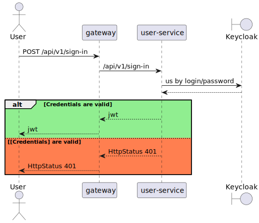
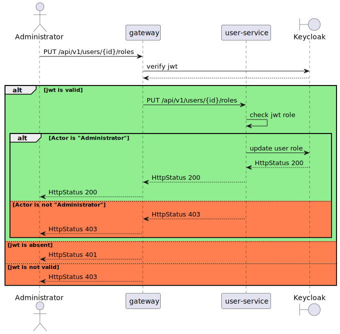
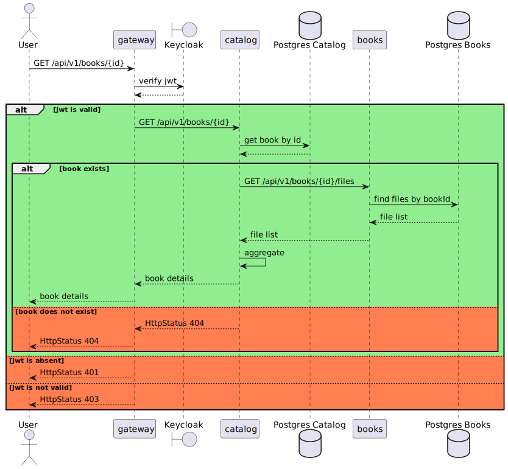
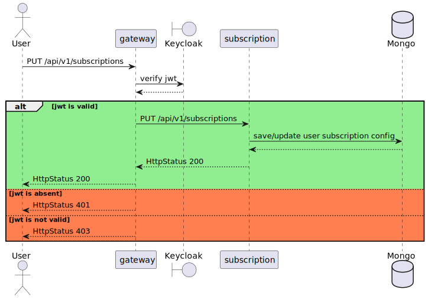

## Библиотека электронных книг с использованием микросервисной архитектуры

Данная система, исходя из названия, будет являться каталогом книг, с возможностью хранения их электронных версий для чтения. Эта система будет предоставлять зарегестрированным пользователям возможность искать книги, скачивать их в предпочитаемом формате из доступных, а тажке, оценивать и оставлять ревью. Администраторы системы, в свою очередь, могут регистрировать книги в каталоге и добавлять их электронные форматы.

### Требования:
- регистрация для пользователей
- администраторы могут делать других пользователей администраторами
- администраторы могут регистрировать новых авторов
- администраторы могу регистрировать новые книги и обновлять их в каталоге
- администраторы могут загружать книги в разных форматах(epub, pdf и т.д.)
- зарегестрированные пользователи могут просматривать и осуществлять поиск книг по различным параметрам
- зарегестрированные пользователи могут скачивать книги в различных форматах
- зарегестрированные пользователи управлять своими подписками на уведомления на почту о новых книгах: любые, по жанру, по автору
- зарегестрированные пользователи могут оценивать книги по 10 бальной шкале
- зарегестрированные пользователи могут оставлять ревью на книги

### Архитектура

#### Ответственности сервисов

- gateway - выполняет роль машрутизатора запросов от пользователей
- catalog - Данный сервис отвечает за хранение и управление каталогом книг, авторов, оценок, а также, 
хранит связь на загруженные электронные форматы
- books - данный сервис отвечает за хранение и загрузку электроных форматов книг
- user-service - отвечает за регистрацию новых пользователей и хранение их данных
- review-service - отвечает за хранение и добавление ревью пользователей к книгам
- auth-service - отвечает за аутентификацию/авторизацию
- user-subscriptions - отвечает за хранение настроек подписок пользователей и обработку событий 
при регистрации новых книг
- email-notify - отвечает за отправку уведомлений на почту

### Use-cases:
#### Регистрация (пользователь)

#### Аутентификация/авторизация по логину/паролю (пользователь)

#### Добавление роли администратра пользователю (администратор)

#### Регистрация нового автора (администратор)

#### Регистрация новой книги в каталоге (администратор)

#### Обновление данных о книге (администратор)

#### Добавление нового формата книги (администратор)

#### Просмотр и фильтрация книг из каталога (пользователь)

#### Просмотр детальной информации о книге (пользователь)

#### Оценка книги по 10 бальной шкале (пользователь)

#### Скачивание книги (пользователь)

#### Добавление ревью (пользователь)

#### Просмотр ревью других пользователей о книге (пользователь)

#### Подписка пользователем на уведомления о новых книгах (пользователь)

#### Просмотр существуюх подписок (пользователь)

#### Получение уведомления на почту (пользователь)

