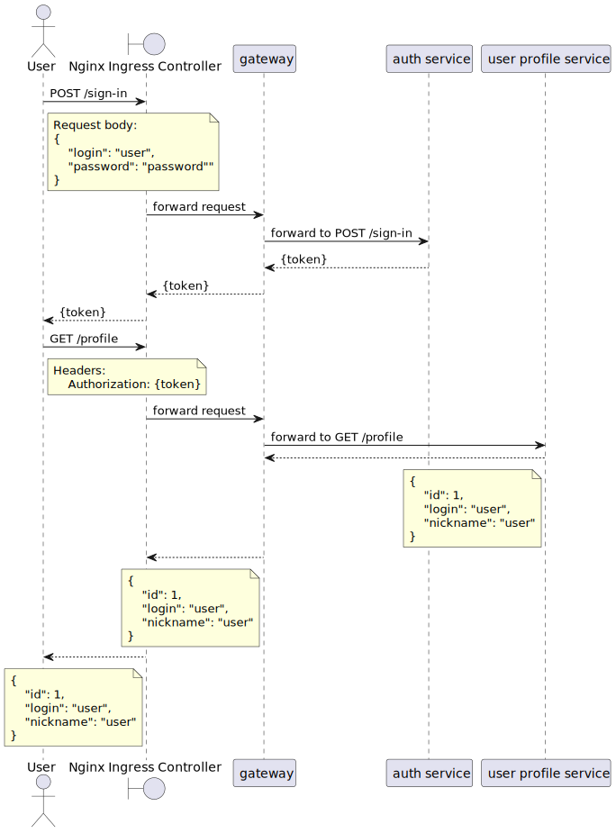

Установка выполняется обычной командой через helm install в default namespace 

В качестве gateway используется **Spring Cloud Gateway**, 
**Nginx Ingress Controller** выполняет только роль связи с внешним миром

* **auth service** - занимается регистрацией и аутентификацей пользователей. при успешной аутентификации в ответе возвращается JWT-токен
* **user profile service** - отвечает за управление профилем пользователя. 
запросы на получение или обновления профеля должны быть авторизованы, т.е. пользователь должен предоставить JWT-токен
* **gateway** - занимается маршрутизацией запросов, а также, проверяет наличие jwt-токена в запросе, а также, 
его валидность (в упрощеном) - если токен не тот который ожидался или отсутствует - запрос дальше не пройдет 
(кроме отдельных endpoint-ов вроде sing-up, sign-in). Таким образом, все сервисы, 
который находятся за gateway-ем могу быть уверены, что если запрос до них дошел, токену внутри запроса можно доверять
и нужно проверить только права доступа для конкретного пользователя

касательно пункта задания **проверка, что пользователь2 не имеет доступа на чтение и редактирование профиля пользователя1.**
в данном случае, эта проверка не нужна из-за дизайна api. Api для работы с профилем подразумевает наличие контекста
данных текущего пользователя в запросе и работает относительно их, у пользователей не будет физичиской возможности изменять данные других пользователей.

[Выполнения сценария из ДЗ](tests.md)